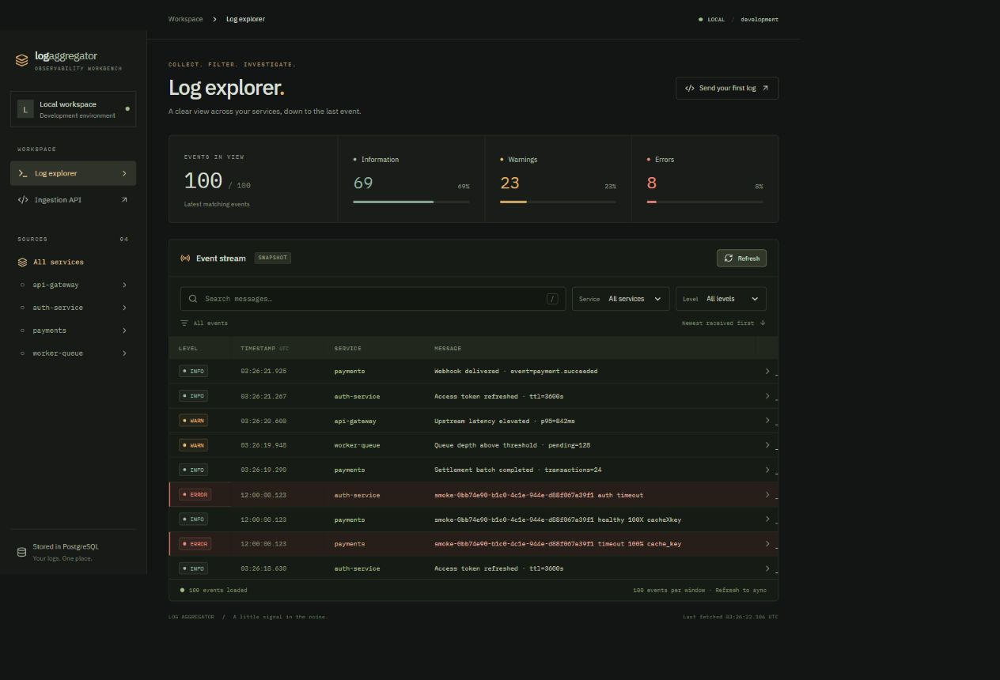
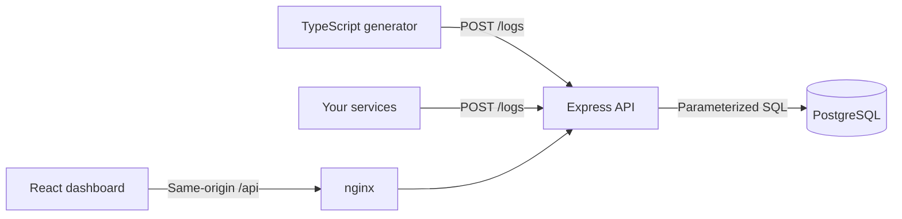

# Log Aggregator

[](https://github.com/lrosse/log-aggregator/actions/workflows/ci.yml)

**A little signal in the noise.** A focused observability workbench for collecting and investigating logs across services.

When a request crosses an API gateway, an identity provider, a payment service and a worker, opening four terminals is a poor debugging workflow. Log Aggregator gives those services one HTTP ingestion endpoint and one searchable timeline, backed by PostgreSQL.



## Run in one command

Prerequisites: Docker Engine/Desktop with Linux containers and Docker Compose v2 or newer. Node.js is **not** required to run the containers.

```sh
git clone https://github.com/lrosse/log-aggregator.git
cd log-aggregator
docker compose up --build
```

The spelling `docker-compose up --build` also works when the Compose compatibility executable is installed. The first run downloads images and installs dependencies. No manual database setup or `.env` file is required.

| Service    | Address                                               | Purpose                                |
| ---------- | ----------------------------------------------------- | -------------------------------------- |
| Dashboard  | [localhost:3000](http://localhost:3000)               | React served by unprivileged nginx     |
| HTTP API   | [localhost:3001/health](http://localhost:3001/health) | Ingestion, queries and readiness       |
| PostgreSQL | Docker network only, port 5432                        | Durable storage; no host port conflict |
| Generator  | No exposed port                                       | Synthetic events from four services    |

Wait for the services to become healthy, then open the dashboard. The generator produces one event roughly every 650 ms, cycling through `api-gateway`, `auth-service`, `payments` and `worker-queue`. These are deliberately synthetic logs, not external production data.

```sh
docker compose up --build -d --wait  # Background mode with readiness checks
docker compose ps                  # All four services should be healthy
docker compose logs -f backend     # Inspect backend operational logs
docker compose stop generator      # Stop synthetic traffic
docker compose start generator     # Resume synthetic traffic
docker compose down                # Stop containers; preserve stored logs
```

`docker compose down -v` also deletes this project's database volume. Use it only when you intend to discard all collected logs.

## Explore the logs

- Combine service, severity (`info`, `warn`, `error`) and message text filters.
- Search uses a case-insensitive **literal substring**; `%` and `_` are not search operators.
- Click a message or its chevron to inspect the full event and copy its JSON.
- Click a severity summary or a sidebar service to filter.
- Press `/` to focus search; Escape closes the inspector.
- Metrics describe the **displayed window**, not total database volume.
- Event timestamps are displayed in UTC. Ordering uses the ingestion ID, so delayed events appear at the top.

The MVP displays up to 100 matching events and refreshes explicitly. Socket.io streaming and cursor pagination are the next milestone, gated on successful Docker MVP verification.

## Architecture



| Layer    | Stack                                                                            |
| -------- | -------------------------------------------------------------------------------- |
| Backend  | Node.js 24 LTS, TypeScript 5.9, Express 5, Zod, node-postgres, Helmet            |
| Database | PostgreSQL 17, SQL migrations, `pg_trgm`                                         |
| Frontend | React 19, TypeScript, Vite, custom CSS, Lucide icons, self-hosted IBM Plex fonts |
| Runtime  | Multi-stage Docker builds, Docker Compose, unprivileged nginx                    |
| Quality  | ESLint 10, Prettier, Vitest, Supertest, React Testing Library, GitHub Actions    |

### Decisions and tradeoffs

- **Small npm workspace monorepo.** API, dashboard and generator have separate builds without an extra orchestration framework. TypeScript 5.9 is retained for lint-toolchain compatibility.
- **PostgreSQL instead of a search cluster.** Relational storage is sufficient for a portfolio workload and simple to operate. Composite service/ID and level/ID indexes support filters; a trigram GIN index supports substring search. Short searches may still scan many rows.
- **Migrate before readiness.** Ordered SQL migrations execute in a transaction protected by an advisory lock. A named volume persists data. Health checks and `service_healthy` dependencies prevent startup races; see [Docker's startup-order documentation](https://docs.docker.com/compose/how-tos/startup-order/).
- **Acknowledge after persistence.** `201 Created` means the insert succeeded. The sender supplies event time; PostgreSQL records `receivedAt`. IDs are strings to avoid JavaScript integer precision loss.
- **Same-origin browser traffic.** nginx forwards `/api` to the backend without permissive CORS. Docker DNS is re-resolved so the proxy survives backend container recreation.
- **Dense, restrained UI.** Charcoal/olive neutrals, amber accents, semantic severity colors, compact rows, a native keyboard-accessible dialog and locally served typography. No external fonts or analytics requests.
- **Local exposure.** Published ports bind to `127.0.0.1`; PostgreSQL has no host port. Backend, generator and nginx processes run without root privileges.

## HTTP contract

### Ingest

```sh
curl -X POST http://localhost:3001/logs \
  -H 'Content-Type: application/json' \
  -d '{"service":"payments","level":"error","message":"Payment gateway timeout","timestamp":"2026-08-26T12:00:00Z"}'
```

PowerShell:

```powershell
$event = @{
  service = 'payments'
  level = 'info'
  message = 'Payment authorized'
  timestamp = [DateTime]::UtcNow.ToString('o')
} | ConvertTo-Json
Invoke-RestMethod http://localhost:3001/logs -Method Post -ContentType 'application/json' -Body $event
```

| Required field | Rules                                                                                  |
| -------------- | -------------------------------------------------------------------------------------- |
| `service`      | 1–80 characters; starts with a letter/digit, then letters/digits/dot/underscore/hyphen |
| `level`        | `info`, `warn` or `error`                                                              |
| `message`      | Nonblank, up to 8,000 characters; outer whitespace is trimmed                          |
| `timestamp`    | ISO 8601 with `Z` or an explicit timezone offset                                       |

Unknown fields and invalid input return `400`; non-JSON content returns `415`; bodies over 16 KiB return `413`. The proxy may return its own oversized-request error body. Errors do not expose database details or submitted payloads.

### Query

```http
GET /logs?service=payments&level=error&q=timeout&limit=50
```

Filters are optional and combined with AND. `limit` defaults to 100 and accepts integers from 1 to 200. Responses contain `{ "logs": [...] }`, newest ingestion first. Each record adds string `id` and UTC `receivedAt` to the input fields. SQL parameters and escaped LIKE metacharacters protect search queries.

`GET /services` returns `{ "services": ["api-gateway", ...] }` alphabetically. `GET /health` returns `200 {"status":"ok"}` only when the logs table is reachable, otherwise `503`.

## Configuration

Copy `.env.example` to `.env` only to change defaults. Compose reads it automatically; Git ignores it.

| Variable                | Default               | Meaning                                |
| ----------------------- | --------------------- | -------------------------------------- |
| `WEB_PORT`              | `3000`                | Local dashboard port                   |
| `API_PORT`              | `3001`                | Local API port                         |
| `POSTGRES_PASSWORD`     | `local-demo-password` | Demo password; use URL-safe characters |
| `GENERATOR_INTERVAL_MS` | `650`                 | Delay between events, 100–60,000 ms    |

Compose supplies backend `DATABASE_URL`/`PORT` and generator `API_URL`. No secrets are compiled into the frontend. Changing the password after database initialization does not change the stored PostgreSQL role; update it explicitly or intentionally recreate a disposable volume.

## Development and verification

For host-side checks, install Node.js 24 and npm:

```sh
npm ci
npm run check          # ESLint + unit/component tests + all production builds
npm run format:check
docker compose up --build -d --wait
npm run smoke          # Real PostgreSQL + HTTP + nginx + generated services
```

The smoke test inserts marked synthetic events into the existing demo services and never deletes data. Set `SMOKE_API_URL`/`SMOKE_WEB_URL` for custom ports.

Tests cover ingest validation, malformed/oversized requests, safe errors, SQL parameters, literal search, combined UI filters, empty results, retry after connection failure and deterministic generator scenarios. The smoke test checks real persistence, combined filters, timestamp normalization, ordering, all four generated services and the nginx proxy. CI repeats formatting, lint, tests, builds and Compose smoke checks on a clean Linux runner.

For frontend hot reload, keep the Compose API on port 3001 and run `npm run dev -w @log-aggregator/frontend`, then open [localhost:5173](http://localhost:5173). Vite proxies `/api` to the backend. For backend-only development, set `DATABASE_URL` to your development PostgreSQL instance and run `npm run dev -w @log-aggregator/backend`; migrations run on startup.

## Scope and production considerations

This is a portfolio project, **not a production log platform**. It has no authentication, tenant isolation, rate limiting, redaction, retention policy, durable queue or high availability. Do not send real secrets or sensitive production logs, and do not expose it publicly. Storage grows until you remove events or recreate the volume. HTTP retries can create duplicates; ingestion does not claim exactly-once delivery. A production evolution would add authentication/TLS, quotas, retention partitions, idempotency, backups, monitoring and load testing.

The generator favors readable scenarios over throughput benchmarking and backs off when ingestion fails. Its four source names are simulations, not four additional application containers.
